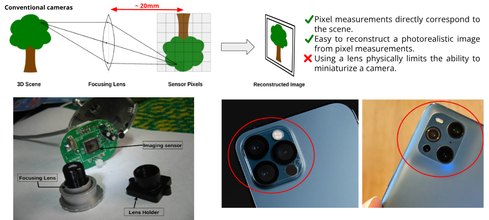
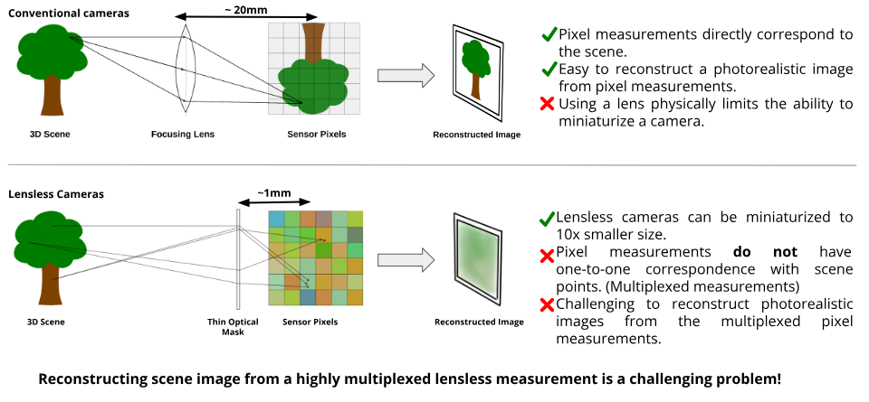
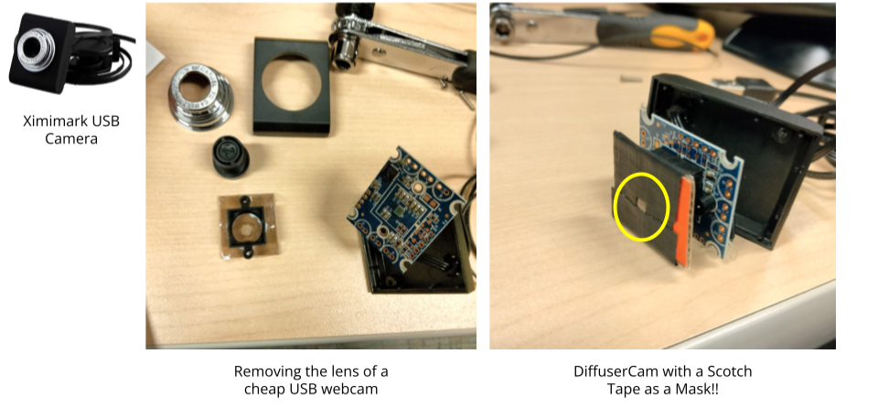
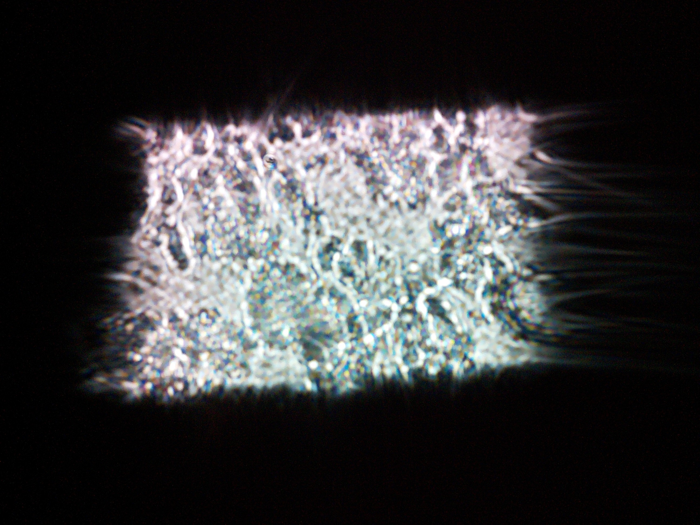
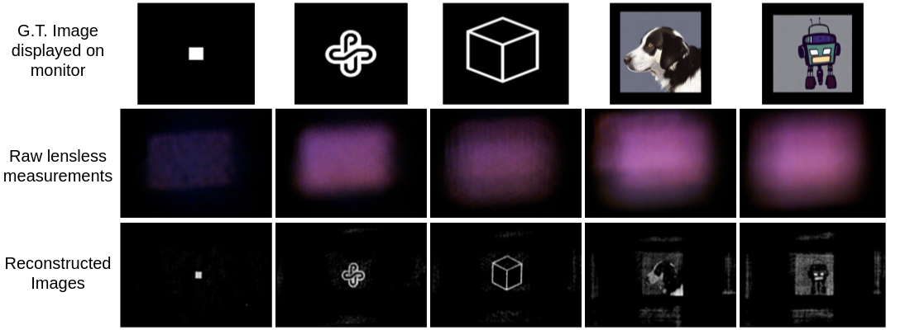

# Lensless camera using a Scotch tape and a webcam

<!-- Place this tag where you want the button to render.
<a class="github-button" href="https://github.com/kaustubh-sadekar/SPAD-Simulator" target="blank_" data-color-scheme="no-preference: light; light: light; dark: dark;" data-size="large" aria-label="Star kaustubh-sadekar/SPAD-Simulator on GitHub">Star Repository</a> -->

## Project in brief
In this project, a low-cost lensless camera was created by replacing the conventional lens with a piece of scotch tape. The process involved disassembling an affordable webcam and substituting its lens with a scotch tape. Following this, calibration of the low-cost lensless camera was conducted using a point light source, capturing the point spread function. The final step involved the application of an iterative Gradient Descent-based algorithm for the reconstruction of the scene image from the raw multiplexed images.

## Conventional camera vs lensless camera
Traditional cameras use a lens to focus light onto a sensor, providing a direct representation of the scene in the raw image. However, this approach has limitations, including bulkiness and constraints on miniaturization.

  

    Figure 1 - Conventional cameras use a focusing lens which physically limits the ability to miniaturize a camera.

Lensless cameras, replacing the lens with a thin optical filter, overcome these limitations by significantly reducing size. Yet, this modification results in entangled information in each pixel, requiring advanced computational methods for accurate scene reconstruction. Achieving photorealistic reconstruction in lensless images poses a challenging problem with infinite solutions.

  

    Figure 2 - Replacing the lens with an optical filter in lensless cameras reduces size but creates a multiplexed blurred image, requiring advanced computational methods for accurate scene reconstruction.

## Converting a cheap webcam into a lensless camera

In the process of crafting a lensless camera from a standard webcam, the initial step involved disassembling the webcam to gain access to its internal components. Following the disassembly, the traditional lens of the webcam was carefully replaced with a piece of Scotch tape. This substitution served as a simple yet effective alternative for creating a lensless configuration. The how-to guide of DiffuserCam was quite helpful (1).

  

    Figure 3 - Creating a custom lensless camera from an affordable webcam.

## Calibration process

Calibrating a lensless camera essentially means computing the point spread function (PSF). In a conventional camera, the lens focuses light rays from a scene point onto a single pixel hence the PSF of a well-focused conventional camera is ideally a single point. In the case of the lensless camera, the scotch tape acts as a diffuser that spreads the light from a single point in the scene to multiple pixels. Moreover, the scotch tape does not have uniform thickness. Therefore, the PSF for scotch tape looks like images of caustics as shown in the following figure.

To capture PSF we capture a point light source in a dark room where no other ambient light is present. The presence of ambient light would result in inaccurate PSF as the light would no longer be coming from a single point-light source. Inaccurate PSF would eventually result in poor image reconstruction. 

  

    Figure 4 - Example of a point spread function image.

The following video shows the process of setting up the lensless camera with the diffuser and capturing some initial PSF measurements using a point light source.

  <iframe width="100%" height="600" src="https://www.youtube.com/embed/2aBt1872YfM?si=wZbAF27hV1gV5GwP" title="YouTube video player" frameborder="0" allow="accelerometer; autoplay; clipboard-write; encrypted-media; gyroscope; picture-in-picture; web-share" allowfullscreen></iframe>

    Initial setup for PSF capturing and lensless camera calibration. Moving the point light source also shifts the PSF pattern.

## Capturing lensless image dataset

Raw lensless measurements were obtained for two distinct scenarios. In the first setup, a large screen was positioned in front of the lensless camera, displaying images while the room remained devoid of additional light sources. In the second setup, representing real-world conditions, various objects were randomly arranged to create small scenes captured by the lensless camera. Finally, the Point Spread Function (PSF) is employed to reconstruct the scene image from the raw lensless images captured by the setup using the iterative gradient descent algorithm proposed in the DiffuserCam paper(1). 

  <iframe width="100%" height="600" src="https://www.youtube.com/embed/bZqHQWhGCLs?si=z_aYD1AK7LokFjYa" title="YouTube video player" frameborder="0" allow="accelerometer; autoplay; clipboard-write; encrypted-media; gyroscope; picture-in-picture; web-share" allowfullscreen></iframe>

  Experiment setup for the screen capture dataset. For most of the images displayed on the monitor, the raw lensless image (blurred-looking image on the right screen) is blurry and has no resemblance with the actual image.

## Results

Findings from screen capture experiments reveal intriguing insights. The reconstruction algorithm proves effective for both simple and complex images, yielding accurate results.

  

    Figure 5 - Reconstruction results for screen capture setup.

## Future work

* Training a deep learning network to predict the reconstructed image from raw lensless camera measurements.
* Simulating PSF dataset using physics-based rendering.

---

## References
1. Nick Antipa, Grace Kuo, Reinhard Heckel, Ben Mildenhall, Emrah Bostan, Ren Ng, and Laura Waller, "DiffuserCam: lensless single-exposure 3D imaging," Optica 5, 1-9 (2018)
